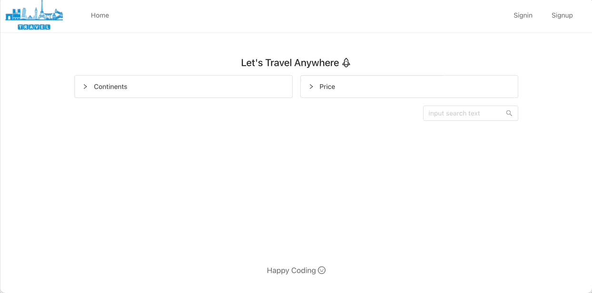
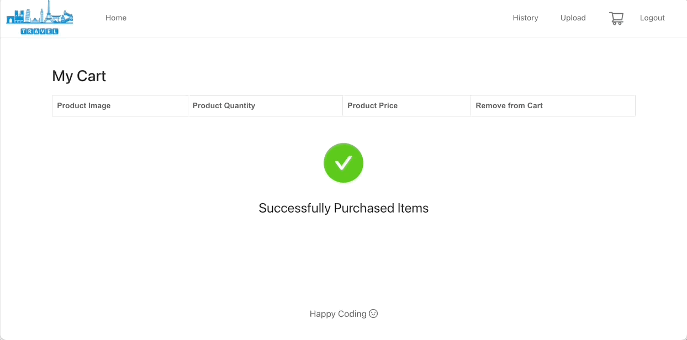

# React-Shoppingmall
John Ahn님의 [boilerplate-mern-stack](https://github.com/jaewonhimnae/boilerplate-mern-stack)을 기반으로 제작한 여행 쇼핑 사이트입니다.
실행을 위해선 다음과 같은 5가지 단계가 필요합니다.
1. dev.js를 'config'파일 안에 생성
2. mongoDB를 dev.js 파일에 연결
3. Server Dependencies를 위해 root directory에서 "npm install" 실행
4. Front-end Dependencies를 위해 client directory에서 "npm install" 실행
5. "npm run dev" 실행

## 사용한 스택

React
Node.js
Redux
MongoDB
Express JS

## 기능 설명

1. 회원가입 & 로그인
  
 
 
 
2. 상품 등록
  
 
 
 
3. 상품 탐색(검색기능과 카테고리 체크)
  
 
 
 
4. 상품 세부 페이지와 장바구니 담기
  
 
 
 
5. 결제하기(Paypal 연동)
  
 
 
 
6. 구매한 내역 확인
  
 
 
